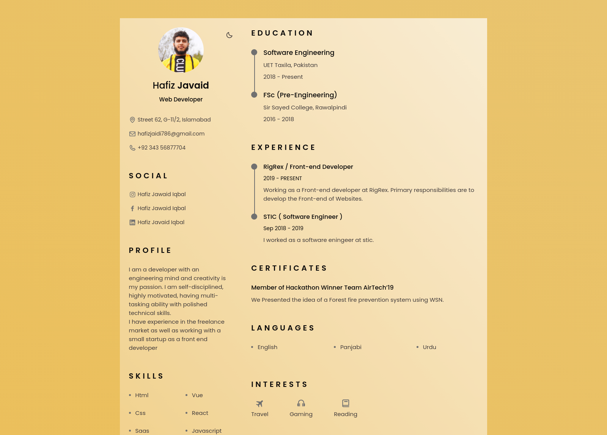
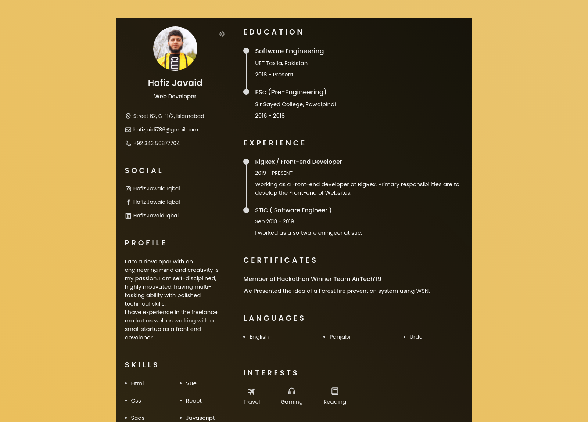

<p align="center"> 
    </img>
    </img>
</p>

<h1 align="center"> Software Developer Resume 🔥 Web Developer Resume 🔥 Software Developer Resume 🔥<h1> 
<h3 align="center"> A clean, beautiful, responsive and 100% customizable Resume <br /> template for Software Developers! | Web Developers</h3>

<p align="center">
 
  <a href="https://reactjs.org/"></a>
 
  <a href="https://github.com/prettier/prettier"></a>

<a href="https://app.netlify.com/sites/ashutosh1919portfolio/deploys"></a>

<a href="https://github.com/ashutosh1919/masterPortfolio/commits/master"></a>
<a href="http://badges.mit-license.org/"></a>

<a href="https://img.shields.io/badge/price-free-ff69b4"></a>

</p>
<p align="center">If you want to discuss about something, then you can ask on my <a href="https://www.fiverr.com/codeaddictor">Fiverr ( Free Help )</a>.</p>

:star: Star us on GitHub — it helps!

# Sections 📚

✔️ Summary and About me\
✔️ Skills \
✔️ Open Source Projects\
✔️ Experience\
✔️ Certifications 🏆\
✔️ Education\
✔️ Contact me

To view a live example, **[click here](https://cv-creator-react.netlify.app/)**

# Clone And Use 📋

- The website is completely built on `react-js` library of `javascript` and that's why we need `nodejs` and `npm` installed.
- While installing `nodejs` and `npm`, try to install versions which are equal or greater than the versions package.json file.
- In case you want to help developing it or simply saving it, you can fork the repository just by clicking the button on the top-right corner of this page.
- After the successful installation of `nodejs` and `npm`, clone the repository into your local system using below command:
  - ```python
     git clone https://github.com/hafizjavaid/CV-Creator-React-Version
    ```
  - This will clone the whole repository in your system.
- To download required dependencies to your system, navigate to the directory where the cloned repository resides and execute following command:
  - ```python
    npm install or yarn add
    ```
- Now, the project is ready to use.
- You can check it using `npm start or yarn start`, it will open the website locally on your browser.

### Personal Information

You will find `src/ResumeData.js` file which contains the complete information about the user. The file looks something like below:

```python
// Home Data
const homeData = {
    ...
}

// Social Links
const socialLinks = {
    ...
}

...
```

You can change the personal information, experience, education, socialLinks, certifications etc. in `src/ResumeData.js` to directly reflect them in portfolio website.

# Deployment 📦

- Once you are done with your setup and have successfully completed all steps above, you need to put your website online!
- I highly recommend using [Github Pages](https://create-react-app.dev/docs/deployment/#github-pages) to achieve this the EASIEST WAY.
- To deploy your website, you have two options. First you need to create a github repository with the name `<your-github-username>.github.io`. Please don't give it any other name.
- Now, you need to generate a production build and deploy the website.

**Option 1:**

- Run `npm run build` to generate the production build folder.
- Enter the build folder, `git init` and push the generated code to the `master` branch of your new repository. That's it. Done.
  You may need to `git init` and force push at every new build.

**Option 2 (will not work with [user pages](https://docs.github.com/en/github/working-with-github-pages/about-github-pages)):**

- Run `npm run deploy` to build and create a branch called `gh-pages`. It will push the `build` files to that branch.
- The last step in deploying is to enable `Github Pages` in settings of the repository and select `gh-pages` branch.

Now, your website is successfully deployed and you can visit it at `<your-github-username>.github.io`.

# Technologies used 🛠️

- [React](https://reactjs.org/)

# References 👏🏻

- The Html Version and Some Design and Implementation Ideas are taken from [Bedimcode](https://www.youtube.com/channel/UCgkDs77BoEhMIgRUB4MKrtQ).

- For Readme I edit the Following repository readme file [ashutosh1919](https://github.com/ashutosh1919/masterPortfolio#readme)
